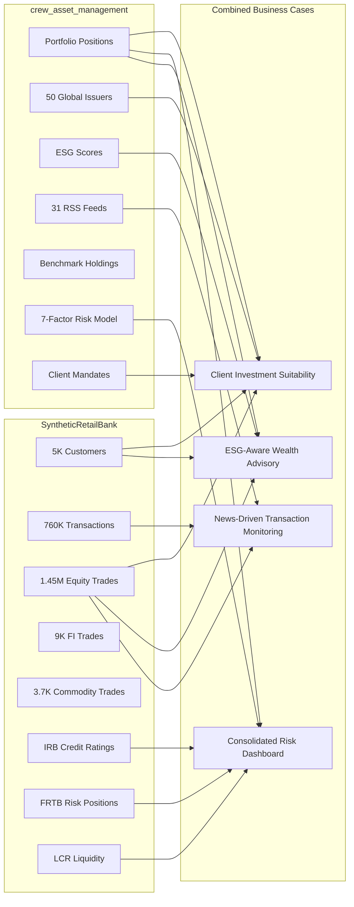

# Cross-Project Showcase Analysis

## Data Landscape

### SyntheticRetailBank (AAA_DEV_SYNTHETIC_BANK)
**Retail banking**: 5K customers, 760K payment transactions, 1.45M equity trades, 9K fixed income trades, 3.7K commodity trades, KYC/AML/sanctions, LCR liquidity, IRB credit risk, FRTB market risk, BCBS 239 reporting.

### crew_asset_management (SAM_DEMO)
**Asset management**: 50 global issuers, daily portfolio positions (ABOR), benchmark holdings/performance, 7-factor risk model, ESG scores, NAV calculations, client mandates, trade settlement, compliance alerts, 31 RSS news feeds, CrewAI agents for crisis/ESG/trend/attribution.

### Shared Data Layer (SAM_DEMO.CURATED)
Already contains the bridge: `DIM_PORTFOLIO`, `DIM_SECURITY`, `DIM_CLIENT`, `FACT_POSITION_DAILY_ABOR`, `FACT_BENCHMARK_HOLDINGS`, `FACT_ESG_SCORES`, `FACT_RISK_LIMITS`, `FACT_COMPLIANCE_ALERTS`, `V_SECURITY_RETURNS`.

---

## Cross-Project Data Map

---

## Proposed Business Cases

### BC1: Client Investment Suitability Assessment

**What**: Cross-reference retail banking customer risk profiles (IRB ratings, AML flags, account tier, income range) with asset management portfolio positions and mandate limits. Determine if each client's portfolio allocation matches their risk tolerance and regulatory suitability requirements (MiFID II, FIDLEG).

**SyntheticRetailBank data**:
- `CRMA_AGG_DT_CUSTOMER_360` -- risk classification, credit score band, account tier
- `REPP_AGG_DT_IRB_CUSTOMER_RATINGS` -- default probability
- `EQTA_AGG_DT_PORTFOLIO_POSITIONS` -- actual equity holdings
- `FIIA_AGG_DT_PORTFOLIO_POSITIONS` -- fixed income holdings
- `CMDA_AGG_DT_PORTFOLIO_POSITIONS` -- commodity holdings

**SAM_DEMO data**:
- `CURATED.DIM_PORTFOLIO` -- portfolio metadata
- `CURATED.DIM_SECURITY` -- security risk attributes
- `CURATED.FACT_RISK_LIMITS` -- mandate concentration limits
- `CURATED.FACT_FACTOR_EXPOSURES` -- factor risk decomposition
- `CURATED.DIM_CLIENT_MANDATES` -- client investment mandates

**Business value**: Proactive suitability breach detection before regulatory audit. Automated MiFID II/FIDLEG compliance evidence.

**Risk of inaction**: Suitability violations discovered during audit (fines, reputation). Manual review cannot scale across 5K clients.

---

### BC2: Consolidated Risk Dashboard (Banking + Asset Management)

**What**: Unified risk view combining retail banking exposures (credit risk, liquidity, market risk) with asset management portfolio risk (factor exposures, benchmark tracking error, ESG risk). Provides a single CRO-level dashboard across both business lines.

**SyntheticRetailBank data**:
- `REPP_AGG_DT_IRB_PORTFOLIO_METRICS` -- aggregate credit risk RWA
- `REPP_AGG_DT_FRTB_CAPITAL_CHARGES` -- market risk capital
- `REPP_AGG_DT_FRTB_SENSITIVITIES` -- risk factor sensitivities
- `REPP_AGG_DT_LCR_DAILY` -- liquidity coverage ratio
- `REPP_AGG_DT_BCBS239_RISK_AGGREGATION` -- aggregated risk positions

**SAM_DEMO data**:
- `CURATED.FACT_FACTOR_EXPOSURES` -- 7-factor model (market, size, value, momentum, quality, volatility, credit)
- `CURATED.FACT_POSITION_DAILY_ABOR` -- daily portfolio positions
- `CURATED.FACT_BENCHMARK_PERFORMANCE` -- benchmark returns
- `CURATED.V_SECURITY_RETURNS` -- security-level returns
- `CURATED.FACT_COMPLIANCE_ALERTS` -- mandate breach alerts

**Business value**: Holistic risk view for CRO/Board. BCBS 239 Principle 1 (Governance) requires enterprise-wide risk aggregation across business lines.

**Risk of inaction**: Siloed risk views per business line. BCBS 239 non-compliance on aggregation principle. CRO lacks consolidated exposure picture.

---

### BC3: ESG-Aware Wealth Advisory

**What**: Enrich the SyntheticRetailBank Customer 360 with ESG preferences and scores from the asset management platform. Enable advisors to recommend ESG-aligned portfolio adjustments and generate compliance reports for sustainability regulation (EU SFDR, Swiss AMAS guidelines).

**SyntheticRetailBank data**:
- `CRMA_AGG_DT_CUSTOMER_360` -- customer demographics, preferences, risk profile
- `EQTA_AGG_DT_PORTFOLIO_POSITIONS` -- current equity holdings per customer
- `EMPA_AGG_DT_ADVISOR_PERFORMANCE` -- advisor-client relationships
- `REPP_AGG_DT_PORTFOLIO_PERFORMANCE` -- portfolio returns (TWR, Sharpe)

**SAM_DEMO data**:
- `CURATED.FACT_ESG_SCORES` -- security-level ESG ratings
- `CURATED.V_HOLDINGS_WITH_ESG` -- portfolio holdings enriched with ESG scores
- `CURATED.DIM_SECURITY` -- security ESG classification
- `CURATED.FACT_PRE_SCREENED_REPLACEMENTS` -- ESG-compliant security alternatives
- SAM_RAW news: ESG controversy detection from CrewAI `crew_esg`

**Business value**: EU SFDR compliance readiness. Advisors can proactively recommend green alternatives. Client retention for ESG-conscious HNW segment (fastest-growing wealth segment).

**Risk of inaction**: No ESG visibility at client level. SFDR reporting gaps. Losing ESG-conscious clients to competitors with sustainability dashboards.

---

### BC4: News-Driven Transaction Anomaly Enrichment

**What**: Correlate payment transaction anomalies (from SyntheticRetailBank AML monitoring) with real-time news events (from crew_asset_management RSS pipeline). When a transaction is flagged as suspicious, automatically check if there's a corresponding news event (e.g., sanctions announcement, company crisis, market disruption) that explains or escalates the alert.

**SyntheticRetailBank data**:
- `PAYA_AGG_DT_TRANSACTION_ANOMALIES` -- flagged transactions with anomaly scores
- `REPP_AGG_DT_HIGH_RISK_PATTERNS` -- suspicious activity patterns
- `CRMA_AGG_DT_CUSTOMER_360` -- customer context for flagged transactions
- `ICGA_AGG_DT_SWIFT_PACS008` -- SWIFT payment details (counterparty, amount, remittance)

**SAM_DEMO data**:
- `RAW` schema news tables (or SAM_RAW_V001 once deployed) -- enriched news events with entity extraction
- `CURATED.DIM_ISSUER` -- entity mapping (company names to tickers)
- Cortex Search Service (`KNOWLEDGE_SEARCH_SVC`) -- semantic search over news
- News trend analysis output -- sector/country crisis signals

**Business value**: Context-aware AML: "this large EUR transfer to a German counterparty coincides with a sanctions escalation in that sector." Reduces false positives by providing explainability. Accelerates SAR decision-making.

**Risk of inaction**: AML alerts reviewed in isolation without market context. False positive rate remains high (industry average: 95%+). Analysts waste time on alerts that news context would immediately explain.

---

## Implementation Priority

| # | Business Case | Complexity | New Objects | All Sources Exist |
|---|--------------|-----------|-------------|-------------------|
| BC1 | Client Investment Suitability | Medium | Cross-DB view + notebook | Yes |
| BC2 | Consolidated Risk Dashboard | Medium | Cross-DB view + Streamlit tab | Yes |
| BC3 | ESG-Aware Wealth Advisory | Medium-High | Cross-DB joins + new DT | Yes |
| BC4 | News-Driven AML Enrichment | High | Cross-DB + Cortex Search integration | Yes |

All data sources already exist in Snowflake. Implementation requires cross-database views/joins between `AAA_DEV_SYNTHETIC_BANK` and `SAM_DEMO`.
