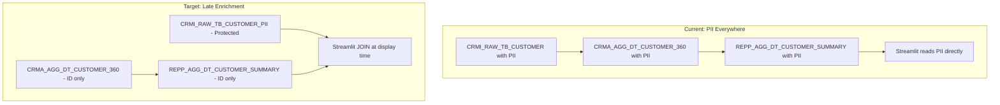

# Plan: Late Enrichment Business Requirement Spec

## Concept

PII is scattered across 16 objects today (5 DTs, 4 views, 4 reporting DTs, 3 raw tables). Late enrichment removes PII from all downstream objects -- they carry only `CUSTOMER_ID`. At display time, the Streamlit app / notebook / semantic view joins back to a single protected PII table, governed by row access policies and masking policies.

## PII Scope (from Snowflake metadata scan)

**76 PII column instances** across 16 objects:

| Schema | Objects with PII | PII Columns |
|--------|-----------------|-------------|
| CRM_RAW_V001 | CRMI_RAW_TB_CUSTOMER, CRMI_RAW_TB_ADDRESSES, CRMI_RAW_TB_EXPOSED_PERSON, EMPI_RAW_TB_EMPLOYEE | FIRST_NAME, FAMILY_NAME, EMAIL, PHONE, DOB, STREET, CITY, ZIPCODE, EMPLOYER, POSITION |
| CRM_AGG_V001 | CRMA_AGG_DT_CUSTOMER_360, CRMA_AGG_DT_CUSTOMER_CURRENT, CRMA_AGG_DT_CUSTOMER_HISTORY, CRMA_AGG_DT_CUSTOMER_LIFECYCLE, CRMA_AGG_DT_ADDRESSES_CURRENT/HISTORY, views (SCREENING_ALERTS, SCREENING_STATUS, ADVISORS, EMPLOYEE_HIERARCHY) | Same PII propagated |
| REP_AGG_V001 | REPP_AGG_DT_ANOMALY_ANALYSIS, REPP_AGG_DT_CUSTOMER_SUMMARY, REPP_AGG_DT_IRB_CUSTOMER_RATINGS, REPP_AGG_DT_LIFECYCLE_ANOMALIES, LOAR_AGG_VW_COMPLIANCE_SCREENING | FULL_NAME |

## Architecture

## Spec Structure

The spec will include:
- **FR-LE-01 to FR-LE-04**: PII vault table, extraction from source, masking/row access policies
- **FR-LE-05 to FR-LE-08**: Refactor downstream DTs/views to remove PII columns, carry only CUSTOMER_ID
- **FR-LE-09 to FR-LE-11**: Late enrichment views/functions for authorized UI-time joins
- **FR-LE-12 to FR-LE-14**: Streamlit/notebook refactoring, audit trail, governance tagging

All 14 FRs with `NEW` status. Data sources all `EXISTS`.

## File

[business_requirements/LATE_ENRICHMENT_BUSINESS_REQUIREMENTS.md](business_requirements/LATE_ENRICHMENT_BUSINESS_REQUIREMENTS.md)
