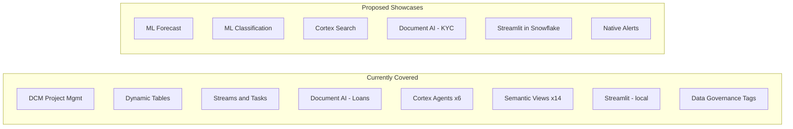
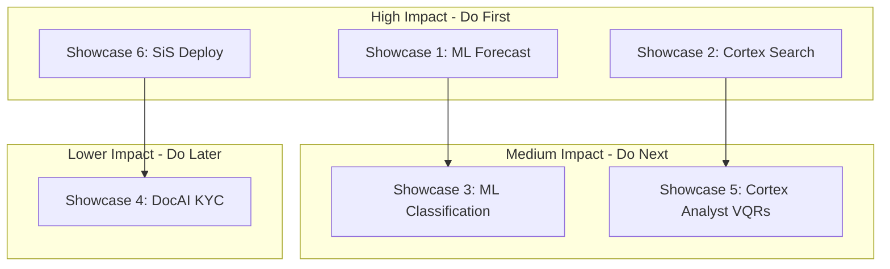

# Plan: Update README, Open Points, and Propose WOW Showcases

## Part 1: README.md Updates

### Fix schema naming throughout
All references to `_001` schemas must change to `_V001`:
- `CRM_RAW_001` -> `CRM_RAW_V001`, `CRM_AGG_001` -> `CRM_AGG_V001` (and all other domains)
- Update the Domains table, manifest variables section, and all examples

### Update data volumes table
Current README shows 100/1K/10K tiers. Add the 5K default:

```
| Customers | Employees | Transactions | Equity Trades | FI Trades | Commodity | SWIFT XMLs | Runtime |
|-----------|-----------|-------------|---------------|-----------|-----------|-----------|---------|
| 1,000     | 15-18     | ~200K       | ~300K         | ~2K       | ~750      | ~600      | 5-7 min |
| 5,000     | 39        | ~760K       | ~1.45M        | ~9K       | ~3.7K     | ~4.8K     | 10 min  |
| 10,000    | 66        | ~2M         | ~3M           | ~18K      | ~7K       | ~10K      | 15-20 min |
```

### Fix project identifier
`AAA_DEV_SYNTHETIC_BANK.PUBLIC.SYNTHETIC_RETAIL_BANK` -> `AAA_DEV_SYNTHETIC_BANK.AAA_DCM.SYNTHETIC_RETAIL_BANK`

### Fix Quick Start default
`./data_generator.sh 1000 --clean` -> `./data_generator.sh 5000 --clean` (since default changed to 5000)

### Add missing generators to Data Generators table
- `lcr_data_generator` (FINMA LCR data)
- `customer_update_generator` (SCD Type 2 updates)

### Add Showcase Section
New section at the end listing all showcase capabilities (notebooks, agents, semantic views, Streamlit app).

---

## Part 2: open_points.md Updates

### Close/Update items
- Update manifest variables table: all `_001` -> `_V001`
- Update DCM project path: `AAA_DCM` schema
- Update architecture tree to include `operation/` and `the_bank_app/` properly

### Add new items (resolved during this session)
| Status | Item |
|--------|------|
| CLOSED | Upload script schema names fixed (`_001` -> `_V001`) |
| CLOSED | Task names fixed (`_TASK_` -> `_TK_`) in operation SQL |
| CLOSED | Generator always produces all base data (FX, PAY, EQT) |
| CLOSED | Commodity trades grouped by date (was one file per timestamp) |
| CLOSED | SWIFT generator path fixed (`generators/swift_message_generator.py`) |
| NEW | SWIFT generation takes ~30 min for 5K customers (subprocess per pair) -- consider batch mode |

---

## Part 3: WOW Showcase Proposals

The current setup covers regulatory compliance (LCR, FRTB, BCBS239, IRB), customer analytics (360, churn, KYC), and trading (equity, FI, commodity). Below are 6 high-impact additions that leverage underutilized Snowflake features.

### Current Feature Coverage



### Showcase 1: Cortex ML Forecasting -- Cash Flow Prediction

**Impact**: HIGH -- demonstrates Snowflake-native ML without external tools

**What**: Use `SNOWFLAKE.ML.FORECAST` on `PAYA_AGG_DT_ACCOUNT_BALANCES` to predict 30-day cash flow per account. Creates an early warning system for accounts trending toward negative balances.

**Implementation**:
- New definition file: `sources/definitions/370_PAYA_ml_forecast.sql`
- New dynamic table: `PAYA_AGG_DT_CASHFLOW_FORECAST`
- New notebook: `notebooks/cashflow_forecasting.ipynb`
- New Streamlit tab: "Cash Flow Forecast" with interactive 30/60/90 day horizon selector
- Training data: 760K+ transactions across 19 months (ideal for time-series)

**Banking value**: Proactive overdraft prevention, treasury planning, client advisory

---

### Showcase 2: Cortex Search -- Compliance Document Search

**Impact**: HIGH -- unique differentiator, no other demo does this

**What**: Build a Cortex Search Service over:
1. SWIFT ISO20022 XML messages (4,800 files) for payment investigation
2. Loan mortgage emails (15 files) for document retrieval
3. Compliance business requirements (3 docs) for policy Q&A

**Implementation**:
- New definition file: `sources/definitions/380_DOCS_cortex_search.sql`
- Create a `DOCS_RAW_V001` schema with a unified document table
- Cortex Search Service: `DOCS_SRV_COMPLIANCE_SEARCH`
- Integration into "Ask AI" Streamlit tab (hybrid: agent + search)
- New notebook: `notebooks/compliance_document_search.ipynb`

**Banking value**: Auditors can search "show me all SWIFT payments over 100K EUR to counterparties in high-risk countries" in natural language

---

### Showcase 3: ML Classification -- Automated Credit Scoring

**Impact**: MEDIUM-HIGH -- shows ML pipeline entirely within Snowflake

**What**: Use `SNOWFLAKE.ML.CLASSIFICATION` to build a credit risk model using:
- Customer attributes (income, employment, account tier, credit score band)
- Transaction behavior (avg amount, frequency, anomaly flags)
- Portfolio metrics (total AUM, number of products)

**Implementation**:
- New definition file: `sources/definitions/530_REPP_ml_credit.sql`
- Training view joining Customer 360 + transaction summary + portfolio
- Model training + inference dynamic table: `REPP_AGG_DT_ML_CREDIT_SCORES`
- Feature importance analysis in notebook
- New notebook: `notebooks/credit_scoring_ml.ipynb`
- Comparison: ML model vs rule-based IRB ratings (already exist in `REPP_AGG_DT_IRB_CUSTOMER_RATINGS`)

**Banking value**: Demonstrates migration from Basel IRB manual models to ML-based scoring within Snowflake

---

### Showcase 4: Expanded Document AI -- KYC Document Processing

**Impact**: MEDIUM -- extends existing DocAI pattern

**What**: Generate synthetic KYC documents (ID verification forms, proof of address, source of wealth declarations) and process them with `SNOWFLAKE.CORTEX.AI_EXTRACT` / `AI_PARSE_DOCUMENT`.

**Implementation**:
- New generator: `generators/kyc_document_generator.py` (produces PDF-like structured text)
- New stage + table: `CRMI_RAW_ST_KYC_DOCS`, `CRMI_RAW_TB_KYC_EXTRACTS`
- New dynamic table: `CRMA_AGG_DT_KYC_COMPLETENESS` (automated KYC gap analysis)
- Feeds into existing Customer 360 and KYC Screening notebook

**Banking value**: Automates the most labor-intensive compliance process (KYC document review)

---

### Showcase 5: Cortex Analyst -- Regulatory Reporting text-to-SQL

**Impact**: MEDIUM -- leverages existing semantic views more visibly

**What**: Create a dedicated "Regulatory Reporting Analyst" experience with a purpose-built semantic view covering BCBS239, FRTB, LCR, and IRB data. Add verified queries (VQRs) for common regulatory questions.

**Implementation**:
- Enhanced semantic view: `REPA_SV_REGULATORY_DASHBOARD` with VQRs like:
  - "What is today's LCR ratio?"
  - "Show me the top 10 customers by risk-weighted assets"
  - "Which asset classes have the highest FRTB capital charges?"
  - "Are we compliant with BCBS 239 Principle 6?"
- New notebook: `notebooks/regulatory_analyst.ipynb` demonstrating Cortex Analyst API
- Integration into Streamlit "Ask AI" tab with a regulatory-specific mode

**Banking value**: Board members and regulators can query risk data without SQL knowledge

---

### Showcase 6: Streamlit in Snowflake (SiS) Deployment

**Impact**: HIGH -- transforms demo from "local app" to "production-ready"

**What**: Deploy `the_bank_app` as a native Streamlit in Snowflake application. Requires adapting the connection layer from `snowflake.connector` to `snowflake.snowpark` session.

**Implementation**:
- Refactor [the_bank_app/utils/snowflake_connection.py](the_bank_app/utils/snowflake_connection.py) to use `snowflake.snowpark.context.get_active_session()`
- Adapt agent calls from REST API to direct SQL `CALL` statements
- Deploy via `snow streamlit deploy` or DCM
- Add to post_deploy.sql

**Banking value**: Zero-install demo -- anyone with Snowflake access can use it immediately

---

## Priority Matrix



## Files to Modify

| File | Change |
|------|--------|
| [README.md](README.md) | Fix schemas, volumes, project ID, add showcase section |
| [open_points.md](open_points.md) | Close resolved items, add new items, update architecture |
| [manifest.yml](manifest.yml) | Already correct (V001) -- no change needed |

## New Files (for showcases -- future work, not part of this PR)

Each showcase would add 2-4 files (definition SQL, notebook, optional generator, Streamlit tab).
